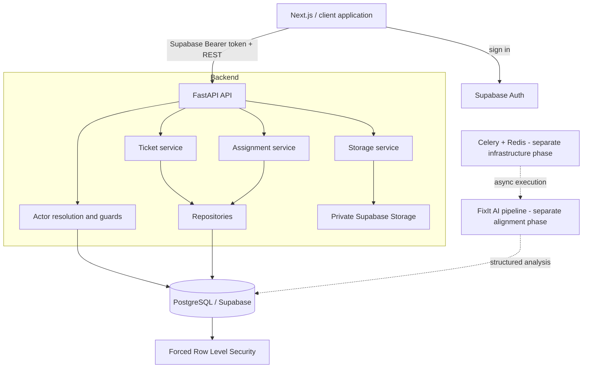
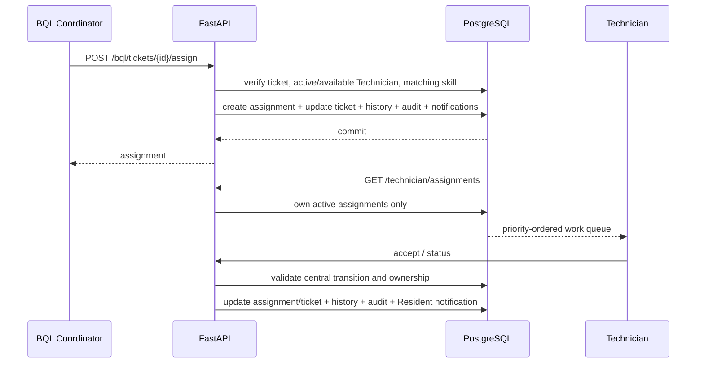

# FixIt Agent Backend Architecture

## System overview

FixIt is a FastAPI backend for apartment-issue intake, AI-assisted triage, BQL coordination, and assignment-scoped Technician work. Supabase Auth supplies verified identities, PostgreSQL/Supabase stores business state, and Row Level Security provides defense in depth.

This repository currently implements the backend and Technician-restoration phase. The lead PRD names a Next.js frontend and Celery/Redis, but those are separate deliverables and are not represented as completed here.

## Runtime actors and identity

```text
auth.users
├── public.residents
├── public.bql_staff
└── public.technician_profiles
```

One Supabase Auth UUID may map to exactly one business profile. There is no application `public.users` table and no role enum used for authorization.

## Component diagram



## Backend layers

- `src/api/routes/`: actor/domain REST endpoints.
- `src/api/dependencies/`: JWT principal resolution, actor lookup, role guards, database session.
- `src/models/api/`: strict Pydantic request/response contracts.
- `src/services/`: transaction boundaries and business rules.
- `src/repositories/`: SQLAlchemy query/persistence operations.
- `src/database/models/`: normalized ORM entities.
- `alembic/versions/`: ordered PostgreSQL migrations and RLS definitions.
- `src/security/`: Supabase JWT verification.

Routes do not accept owner/actor identifiers when those values can be derived from the verified token. Services coordinate atomic history, audit, and notification writes.

## Implemented Technician workflow



Active transition rules in this phase:

```text
assigned -> accepted
accepted -> in_progress
assigned|accepted|in_progress -> unable_to_handle
unable_to_handle returns ticket -> waiting_assignment
```

Completion remains blocked until Technician-owned signed upload sessions can prove completion-photo ownership and one-time consumption.

## Security boundaries

- Supabase access tokens are verified before actor resolution.
- Email-only unknown users cannot become BQL or Technician automatically.
- Resident ticket access requires active unit membership.
- BQL operational access requires an active BQL profile.
- Technician access requires an active Technician profile and an active assignment.
- Cross-Technician and unassigned records are masked as 404 by the backend and denied by RLS.
- Direct client mutations for assignments, audit, AI, and scoring are not granted.
- Storage objects are private and exposed only through bounded signed URLs.
- Secrets remain in local/runtime environment settings and must never be committed.

## Database core

Key tables for the implemented phase:

```text
residents
bql_staff
technician_profiles
resident_unit_memberships
technician_skills
tickets
ticket_assignments
ticket_attachments
ticket_status_history
notifications
audit_logs
ai_analysis_runs
ticket_scoring_results
```

Alembic head for the working tree is `f6a7b8c9d0e1`, directly following the already-applied `e5f6a7b8c9d0` cutover migration. Live execution is always an explicit, gated action.

## Lead-spec alignment boundary

The lead documents also require P0 manual review, final Category/Severity/Priority contracts, red-flag/scoring behavior, Density, batching, reports, push/SMS delivery, Celery/Redis, and a Next.js frontend. These remain separate phases; this architecture document does not falsely mark them implemented.
